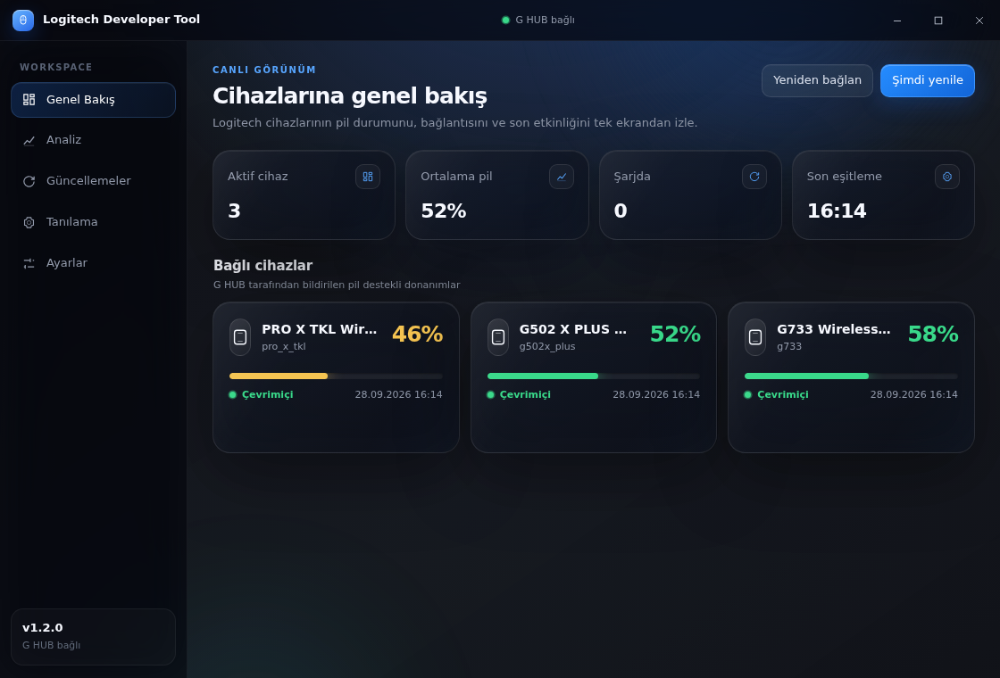
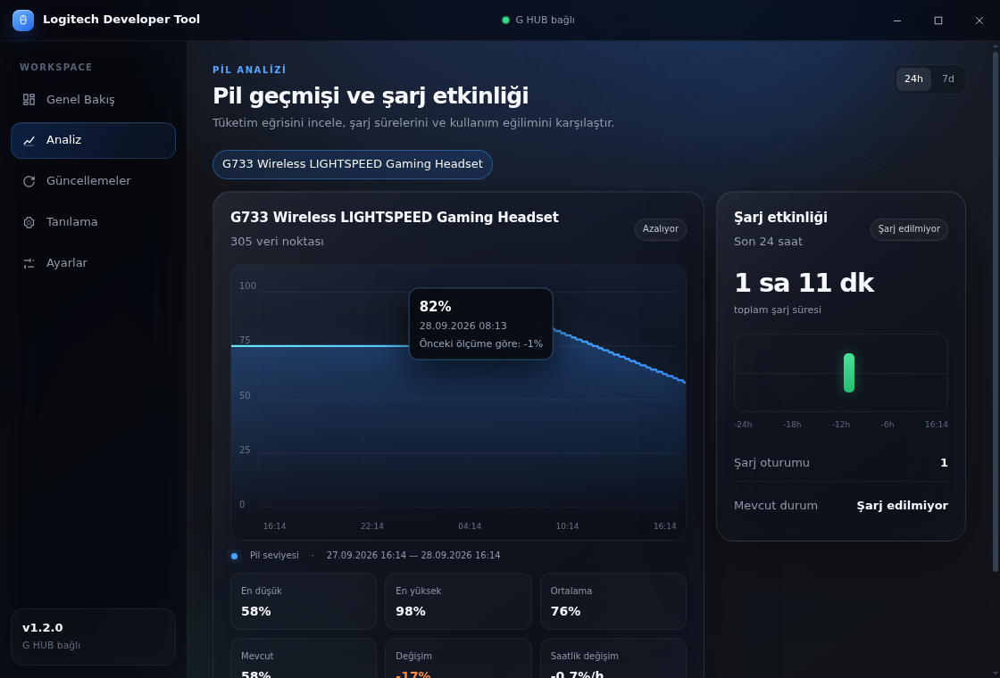

# Logitech Developer Tool

A lightweight Windows tray application that reads battery information from the local Logitech G HUB service. It keeps battery status visible, records local history, shows charging activity, and warns you before a device runs out of power.

[Download the latest Windows release](https://github.com/battincik/logitech-api/releases/latest) · [Changelog](CHANGELOG.md) · [Report a bug](https://github.com/battincik/logitech-api/issues/new?template=bug_report.yml) · [Request a feature](https://github.com/battincik/logitech-api/issues/new?template=feature_request.yml)

## Dashboard

The dashboard uses a compact Liquid Glass interface with a custom Windows title bar, responsive device cards, battery analytics, and an iPhone-inspired charging timeline.





## Features

- Live battery status for supported Logitech G devices
- Liquid Glass dashboard with a custom Windows title bar
- Custom application and installer icon
- Interactive 24-hour and 7-day battery charts with point inspection
- Charging duration, sessions, and timeline for the last 24 hours
- Color-coded tray, battery bars, and connection indicators
- Charging, full battery, low battery, empty battery, and disconnect notifications
- Seven-day local history with automatic sampling and retention
- G HUB connection status, automatic reconnect, and manual reconnect
- Optional automatic startup with Windows
- Turkish and English interface languages
- Commit-based in-app updates with rollback to the bundled version
- Local diagnostics, logs, and a copyable diagnostic report

## Privacy

Battery readings, preferences, history, and logs stay on the computer. The application does not require an account, telemetry, a cloud service, or a background server.

It only connects to:

- `ws://127.0.0.1:9010` for the local G HUB service
- GitHub's public API to check and download the in-app update bundle

## Install on Windows

1. Open [Releases](https://github.com/battincik/logitech-api/releases/latest).
2. Download one of the Windows x64 builds:
   - `Logitech-Battery-API-Setup-<version>-x64.exe` for a normal installation, Start menu entry, and optional desktop shortcut.
   - `Logitech-Battery-API-Portable-<version>-x64.exe` to run without installation.
3. Run the selected executable.
4. Keep Logitech G HUB running in the background.

The application starts in the notification area. Left-click the tray icon to open the dashboard or right-click it for the native menu.

The executable is currently unsigned, so Windows SmartScreen may show a warning on first launch. Confirm that the file came from this repository and compare the SHA-256 digest shown on the release page.

## Requirements

### Users

- Windows 10 or Windows 11, x64
- Logitech G HUB running in the background
- A supported Logitech G device with battery reporting

### Contributors

- Node.js 20 or newer; Node.js 22 LTS is recommended
- npm
- Windows for final application verification

## Development

```powershell
git clone https://github.com/battincik/logitech-api.git
cd logitech-api
npm install
npm run dev
```

If G HUB cannot be detected, verify that `lghub_agent.exe` is running and port `9010` is listening:

```powershell
Get-NetTCPConnection -LocalPort 9010 -State Listen
```

G HUB's local interface is undocumented and may change in future G HUB versions.

## Tests

```powershell
npm test
```

The test command compiles the project, regenerates the update bundle, validates dashboard JavaScript, and runs the Node.js test suite.

## Build Windows executables

```powershell
npm run dist
```

Output:

```text
release/Logitech-Battery-API-Setup-<version>-x64.exe
release/Logitech-Battery-API-Portable-<version>-x64.exe
```

Build only one target when iterating on packaging:

```powershell
npm run dist:installer
npm run dist:portable
```

## Publishing an update

The running application updates from `updates/app.cjs` on the configured public branch. GitHub Releases are used to distribute complete portable executables.

1. Update the version when preparing a public release.
2. Change the source code and documentation.
3. Run `npm test`; commit the regenerated `updates/app.cjs` file.
4. Open a pull request and complete the review checklist.
5. Merge the pull request so existing clients can detect the new bundle.
6. Run `npm run dist` and attach both executables to a versioned GitHub Release.
7. Publish the SHA-256 digest with the release notes.

Changes to Electron, native dependencies, packaging metadata, the executable name, or the Windows application identity always require a new portable executable.

## Project structure

- `src/main.ts` — tray, dashboard window, IPC, notifications, and diagnostics
- `src/dashboard.ts` — Liquid Glass interface, charts, charging timeline, and preload bridge
- `src/ghub-client.ts` — G HUB WebSocket client and reconnect logic
- `src/app-store.ts` — local preferences and seven-day battery history
- `src/battery-events.ts` — battery and charging notification rules
- `src/updater.ts` — commit-based updater and bundle validation
- `src/state-store.ts` — notification threshold state
- `updates/app.cjs` — generated in-app update bundle
- `docs/` — dashboard screenshots and documentation assets

## Contributing

Contributions are welcome. Read [CONTRIBUTING.md](CONTRIBUTING.md) before opening a pull request. Use the issue templates for reproducible bug reports and focused feature proposals.

Security issues should follow [SECURITY.md](SECURITY.md) instead of a public issue.

## License

See [LICENSE](LICENSE) for the current license terms.
